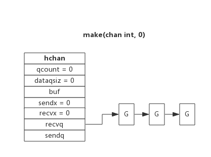

# channel 的使用

channel（管道）是 goroutine 之间通信的一种方式，管道实现了一种 FIFO 队列，数据总是按照写入的顺序被读取

## 1. 初始化

可以通过以下两种方式初始化一个管道：

### 1. 声明变量

这种方式声明的管道，值为 nil

```go
var ch chan bool
```

### 2. 使用 make() 函数

可以通过 make 创建无缓存管道或带缓存管道

```go
ch1 := make(chan bool)  // 无缓冲管道
ch2 := make(chan bool, 10) // 带缓存管道
```

## 2. 管道操作

### 1. 操作符

可以通过 "<-" 操作符对管道内元素进行读写

```go
ch := make(chan int, 10)
ch <- 10   // 数据写入管道
<- ch      // 从管道读取数据
```

默认管道是双向可读写，也可以通过操作符进行限定

```go
ch1 := make(<-chan int) // 只能从管道读取数据
ch2 := make(chan<- int) // 只能向管道写入数据
```

### 2. 数据读写

三种形式的管道：

- 当管道无缓冲区
  - 读数据阻塞，直到另一个 goroutine 向管道中写入数据
  - 写数据阻塞，直到另一个 goroutine 从管道中读取数据
- 当管道有缓冲区
  - 当缓冲区为空时，读数据阻塞，直到另一个 goroutine 向管道中写入数据
  - 当缓冲区已满时，写数据阻塞，直到另一个 goroutine 从管道中读取数据
- 当管道为 nil，读写数据永久阻塞

### 3. 关闭管道

使用内置函数 `close()` 可以关闭管道，当向关闭的管道进行：

- 写操作，触发 panic
- 读操作
  - 当管道的缓冲区有数据，读取管道中缓冲区数据
  - 当管道的缓冲区无数据，读取到类型零值
- 再次 `close()`，触发 panic

当**管道已关闭**，**且缓冲区无数据**，管道读取操作的第二个变量和管道的关闭状态一致：

```go
v, ok := <-ch
```

例如：

```go
func main() {
    ch := make(chan int, 10)
    go func() {
        for i := range make([]int, 10) {
            ch <- i
            time.Sleep(time.Second)
        }
        close(ch)
    }()
    for {
        // 如果管道没数据，结束 for{}
        if v, ok := <- ch; ok {
            fmt.Println(v)
        } else {
            break
        }
    }
}
```

### 4. 小结

`len()` 可以查询管道中缓冲区数据个数

`cap()` 可以查询缓冲区大小

当 goroutine 读取管道时，阻塞的条件有：

- 管道为 nil
- 管道无缓冲区
- 管道缓冲区为空

当 goroutine 写入管道时，阻塞的条件有：

- 管道为 nil
- 管道无缓冲区
- 管道缓冲区已满

会触发 panic 的操作：

- 关闭值为 nil 的管道
- 关闭已经被关闭的管道
- 向已经被关闭的管道写入数据

## 3. 常见用法

### 1. 单向管道

单向管道指只能用于发送或接收数据的管道，通常在函数中通过形参限定函数内部管道操作

例如：

```go
// 限定只能从 ch 中读取数据
func readChan(ch <-chan int) {
    <- chanName
}

// 限定只能向 ch 写入数据
func writeChan(ch chan<- int) {
    chanName <- 1
}

func main() {
    var mychan = make(chan int, 10)

    writeChan(mychan)
    readChan(mychan)
}
```

### 2. for-range

通过 for-range 可以持续从管道中读出数据，好像在遍历一个数组一样，当管道中没有数据时会阻塞当前 goroutine，与读管道数据时阻塞处理机制一样

在 for-range 中，当管道已关闭，且缓冲区无数据，跳出循环

```go
func main() {
    ch := make(chan int, 10)
    go func() {
        for i := range make([]int, 10) {
            ch <- i
            time.Sleep(time.Second)
        }
        close(ch)
    }()
    // 这个 for 等价于下面的 for{}
    for v := range ch {
        fmt.Println(v)
    }
    //for {
    //    // 如果管道没数据，结束 for{}
    //    if v, ok := <-ch; ok {
    //        fmt.Println(v)
    //    } else {
    //        break
    //    }
    //}
}
```

### 3. select

使用 select 可以监控多个管道，当其中某一个管道可操作时触发相应的 case 分支

例如：

```go
package main

import (
    "fmt"
    "time"
)

func addNumberToChan(chanName chan int) {
    for {
        chanName <- 1
        time.Sleep(1 * time.Second)
    }
}

func main() {
    var chan1 = make(chan int, 10)
    var chan2 = make(chan int, 10)

    go addNumberToChan(chan1)
    go addNumberToChan(chan2)

    for {
        select {
        case e := <- chan1 :
            fmt.Printf("Get element from chan1: %d\n", e)
        case e := <- chan2 :
            fmt.Printf("Get element from chan2: %d\n", e)
        default:
            fmt.Printf("No element in chan1 and chan2.\n")
            time.Sleep(1 * time.Second)
        }
    }
}
```

# channel 的实现原理

# 1. 数据结构

在 src/runtime/chan.go 中定义了 channel 的数据结构：

```go
type hchan struct {
    // 循环队列
    qcount   uint           // 当前队列中剩余元素个数
    dataqsiz uint           // 循环队列长度，即可以存放的元素个数
    buf      unsafe.Pointer // 循环队列指针
    sendx    uint           // 循环队列下标，指示元素写入时存放到队列中的位置
    recvx    uint           // 循环队列下标，指示元素从队列的该位置读出

    // goroutine 等待队列
    recvq    waitq  // 等待读的 goroutine 队列
    sendq    waitq  // 等待写的 goroutine 队列

    // 类型信息
    elemsize uint16 // 每个元素的大小
    elemtype *_type // 元素类型

    closed   uint32  // 标识关闭状态
    lock     mutex   // 互斥锁，chan不允许并发读写
}
```

从数据结构中可以看出，channel 主要由循环队列、类型信息、groutine 等待队列构成

### 1. 循环队列

chan 内部使用循环队列作为缓冲区，队列的长度是创建管道时指定的

下图展示了一个可缓存 6 个元素的 channel 示意图：


- dataqsiz 指示了队列长度为 6，即可缓存 6 个元素
- buf 指向循环队列的内存
- qcount 表示队列中还有两个元素
- sendx 指示后续写入的数据存储的位置，取值[0, 6)
- recvx 指示从该位置读取数据, 取值[0, 6)

### 2. 等待队列

前面有提到 goroutine 阻塞的情况，被阻塞的 goroutine 将会被挂在 channel 的等待队列中：

下图展示了一个没有缓冲区的 channel，有几个 goroutine 阻塞等待读数据：



处于等待队列中的 goroutine 会在其他 goroutine 操作管道时被唤醒：

- 因读阻塞的 goroutine 会被向 channel 写入数据的 goroutine 唤醒
- 因写阻塞的 goroutine 会被从 channel 读出数据的 goroutine 唤醒

### 3. 类型信息

一个管道只能传递一种类型的值：

- elemtype 代表类型，用于数据传递过程中的赋值
- elemsize 代表类型大小，用于在 buf 中定位元素位置

## 2. 管道操作

### 1. 创建管道

在 src/runtime/chan.go 中的 `makechan()` 函数中实际完成了创建管道的过程

创建管道的过程就是初始化 hchan 结构，其中类型信息和缓冲区长度通过 make 传入，buf 的大小则由元素大小和缓冲区长度共同决定

其伪代码如下：

```go
func makechan(t *chantype, size int) *hchan {
    var c *hchan
    c = new(hchan)
    c.buf = malloc(元素类型大小*size)
    c.elemsize = 元素类型大小
    c.elemtype = 元素类型
    c.dataqsiz = size

    return c
}
```

### 2. 向管道写数据

在 src/runtime/chan.go 中的 `chansend()` 函数中实际完成了向管道写数据的逻辑

向管道中写入数据的核心思想是"如果数据能放缓冲区就放，放不了缓冲区就进等待队列"

优化的点是如果此时等待读的队列不为空，就直接将数据给等待队列中的 goroutine 而不需要再放入缓冲区

其简单流程图如下：


### 3. 从管道读数据

在 src/runtime/chan.go 中的 `chanrecv()` 函数中实际完成了从管道读数据的逻辑

从管道中读数据的核心思想是"如果缓冲区有数据就从缓冲区读，如果缓冲区没数据就进入等待队列"

优化的点是如果此时等待写的队列不为空，就直接从等待队列中的 goroutine 获取数据

为了维护 FIFO，当等待队列不为空，缓冲区也有数据时，应该先从缓冲区获取数据

当 sendq 非空，缓冲区肯定满了

其简单流程图如下：


### 4. 关闭管道

在 src/runtime/chan.go 中的 `closechan()` 函数中实际完成了关闭管道的逻辑

关闭管道时会处理等待队列中的 goroutine：

- 把 recvq 中的 goroutine 全部唤醒，写入对应类型的零值
- 把 sendq 中的 goroutine 全部唤醒，触发 panic
