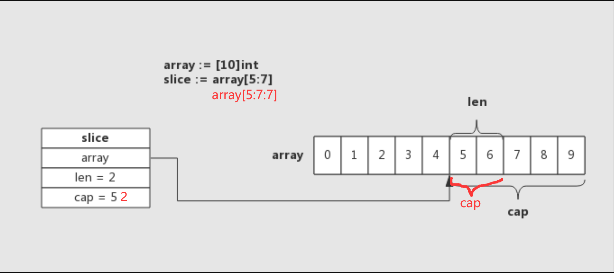
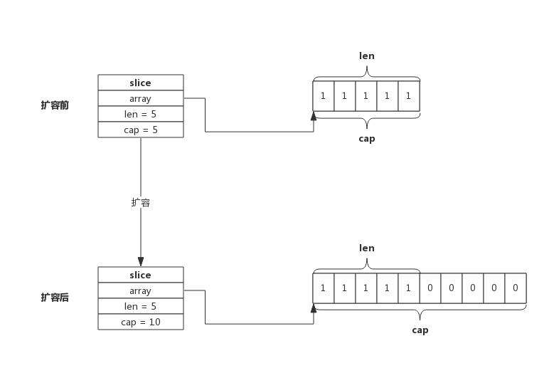

# slice 的使用

slice 是动态数组，依托于数组实现，可以方便进行扩容和传递，实际使用比数组更灵活

## 1. 初始化

可以通过以下四种方式初始化切片

### 1. 声明变量

这种方式声明的切片，值为 nil

```go
var s []int
```

### 2. 字面量

```go
s1 := []int{}   // 空切片
s2 := []int{1, 2, 3}   // 长度为 3 的切片
```

空切片是指所指向数组的长度为 0，声明的切片值为 nil 是指所指向的数组为 nil，它们不是一个东西

### 3. 使用 make() 函数

```go
s1 := make([]int, 10)   // 指定长度
s2 := make([]int, 10, 100)  // 指定长度和空间
```

使用 `make()` 函数创建切片，元素均初始化为类型零值

### 4. 从切片或数组切取

```go
arr := [5]int{1,2,3,4,5}
s1 := arr[0:2]  // 从数组中切取
s2 := s1[0:1]   // 从切片中切取
```

从切片或数组切取出来的切片，会与原数组或原切片共享底层空间，修改切片会影响原数组或切片

## 2. 切片操作

使用 `append()` 函数可以向切片中追加元素：

```go
s := make([]int, 0)
s = append(s, 1)   // 追加单个元素
s = append(s, []int{1,2,3}...)   // 追加多个元素
```

小 Tips：

- 当切片为 nil，使用 `append()` 可以直接追加元素，`append()` 会帮忙做切片底层数组的初始化
- 在函数中对传入切片执行 `append()` 无法作用于原切片

## 3. 切片表达式

slice 表达式可以基于 string 生成子 string，也能从数组或切片中生成切片

Go 提供两种 slice 表达式：

- 简单表达式 a[low : high]
- 扩展表达式 a[low : high : max]

### 1. 简单表达式

简单表达式的格式为：

```go
a[low : high]
```

如果 a 为数组或切片，取 a 位于 [low, high) 的区间元素生成新的切片；如果 a 为字符串，则生成子字符串

#### 1. 底层数组共享

使用简单表达式生成的切片与原数组或切片共享底层数组，新切片的属性为：

```go
b.array = &a[low]
b.len = high - low        // 新切片的 len 为切的范围
b.cap = cap(a) - low      // 新切片的 cap 为原 cap 减去切掉左半部分
```

例如：

```go
s1 := make([]int, 5, 10)
s2 := s1[3:8]
fmt.Println(len(s2)) // 5
fmt.Println(cap(s2)) // 7
```

由于底层数组共享，如果使用 `append()` ，可能会覆盖原数组元素，而这并不是我们的本意，例如：

```go
a := [3]int{1, 2, 3}
s1 := a[0:1]
s1 = append(s1, 6)
fmt.Println(a)   // 1 6 3 修改了原数组
```

#### 2. 边界问题

对于切片，简单表达式 `a[low : high]` 中 low 与 high 的取值范围为：

```go
0 <= low <= high <= cap(a)
```

即 low 和 high 的取值可以超越 len(a)，需要额外注意

#### 3. 默认值

在 `a[low : high]` 中，low 和 high 是可以省略的，low 的默认值为 0，high 的默认值为表达式作用对象的长度

例如：

```go
a[:high]  // 等价于 a[0:high]
a[0:]     // 等价于 a[0:len(a)]
a[:]      // 等价于 a[0:len(a)]
```

这要注意，high 的默认值为表达式作用对象的长度，在下面这个例子中，将发生 panic：

```go
s1 := make([]int, 5, 10)
s2 := s1[7:] // s1[7:len(s1)] = s1[7:5]
```

### 2. 扩展表达式

在简单表达式中新生成的切片，`容量 = cap(a) - low`，可能被迫"共享"底层数组，可以使用扩展表达式解决这个问题，其语法为：

```go
a[low : high : max]
```

max 用于限制新切片的容量，新切片容量为 max - low， 表达式中 low、high、max 需要满足关系：

```go
0 <= low <= high <= max <= cap(a)
```

下面分别是使用简单表达式和使用扩展表达式新生成切片的结构：

- 使用简单表达式

  

- 使用扩展表达式

  

通过使用扩展表达式，将新切片的容量限制为 2，避免了被迫"共享"底层数组

扩展表达式中的 a[low : high : max] 只有 low 是可以省略的，其默认值为 0

扩展表达式只可作用于数组、切片，不能作用于字符串

# slice 的实现原理

slice 依托数组实现，底层数组对用户屏蔽，在底层数组容量不足时可以实现自动重分配并生成**新**的 slice

## 1. 数据结构

在 src/runtime/slice.go 中定义了 slice 的数据结构：

```go
type slice struct {
    array unsafe.Pointer   // 指向底层数组的指针
    len   int              // 切片长度
    cap   int              // 底层数组容量
}
```

## 2. 切片操作

### 1. 使用 make() 创建切片

使用 `make()` 创建 slice 时，可以同时指定长度和容量，创建时底层会分配一个数组，数组的长度即容量

例如，`s := make([]int, 5, 10)` 所创建的 Slice，结构如下图所示：


### 2. 使用数组创建切片

使用数组创建 slice 时，slice 将与原数组共用一部分内存

例如，`s := array[5:7]` 所创建的 Slice，结构如下图所示：


切片从数组 array[5] 开始，到数组 array[7] 结束，即切片长度为 2，数组后面内容作为切片预留内存，即切片容量为 5

### 3. 扩容

使用 `append()` 向 slice 追加元素的步骤如下：

- 如果 slice 容量够用，则将新元素追加进 slice，slice.len++，返回原 slice

- 如果 slice 空间不足，将会触发 slice 扩容得到新 slice，将新元素追加进新 slice，返回新的 slice

例如，当向一个 cap 为 5，且 len 也为 5 的 slice 追加 1 个元素时，就会发生扩容，如下图所示：



扩容容量的选择遵循以下规则：

- 如果原 Slice 容量小于 1024，则新 Slice 容量将扩大为原来的 2 倍
- 如果原 Slice 容量大于等于 1024，则新 Slice 容量将扩大为原来的 1.25 倍

另外在此基础上，考虑元素类型和内存分配规则，对实际扩张值进行微调（内存对齐）

### 4. 切片拷贝

使用 `copy()` 内置函数拷贝两个切片时，会将源切片的数据逐个拷贝到目的切片指向的数组中，**拷贝数量取两个切片长度的最小值**
