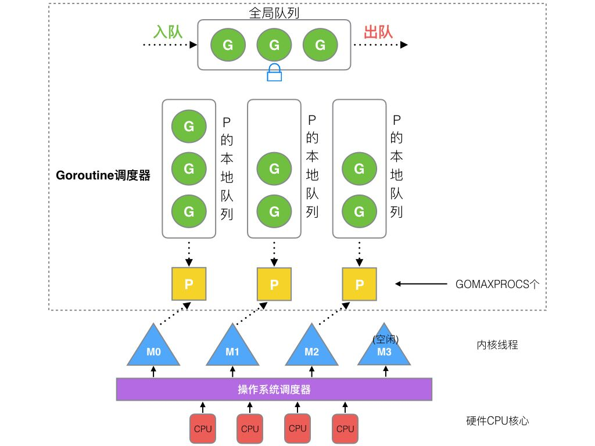
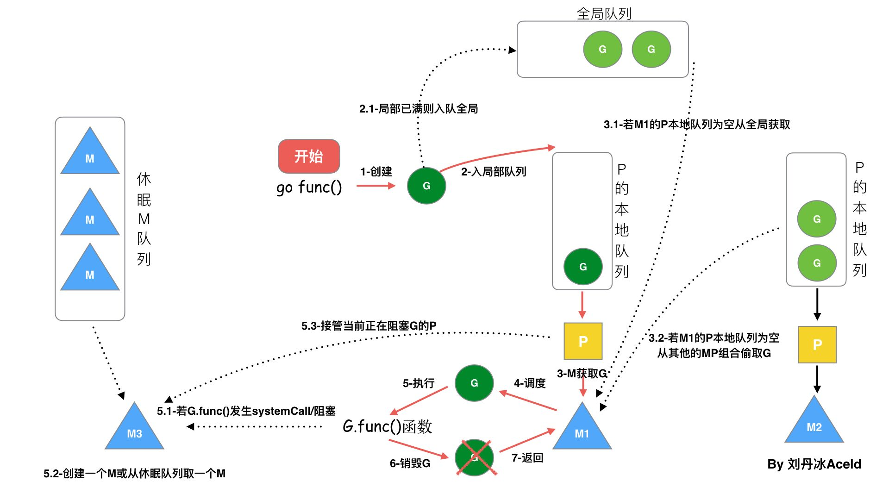

## 1. 协程的概念

协程的设计来自 CSP 模型，Go 在语言层面直接提供对协程的支持称为 goroutine

### 1. 基本概念

- 进程：进程是正在运行的程序，每个进程都有独立的内存空间，进程间通过进程间的通信方式来通信
- 线程：线程从属于进程，每个进程至少包含一个线程，线程是 CPU 调度的基本单位，一个进程内的多个线程可以共享进程的资源
- 协程：协程是轻量级线程，不受操作系统调度，协程调度器由用户应用程序提供，协程调度器按照调度策略把协程调度到线程中执行

### 2. 协程的优势

通过更少的线程减少线程切换的开销，工作在用户态的协程上下文切换开销更低，相比于线程，占用内存更少

## 2. 调度模型

### 1. 线程模型

线程可分为用户线程和内核线程，用户线程由用户创建、同步和销毁，内核线程则由内核管理，根据用户线程管理方式的不同，分为三种线程模型：

- N：1 模型，N 个用户线程运行在 1 个内核线程中，优点是线程上下文切换比较快，缺点是无法充分利用 CPU 多核的算力
- 1：1 模型，1 个用户线程运行在 1 个内核线程中，优点是充分利用 CPU 的算力，缺点是线程上下文切换比较慢
- M：N 模型，M 个用户线程运行在 N 个内核线程中，优点是充分利用 CPU 的算力且用户线程上下文切换快，缺点是该模型的调度算法比较复杂

### 2. GMP 调度器模型

Go 协程调度模型中包含三个实体：

- M：内核线程，由操作系统调度
- P：处理器，包含运行 Go 代码的必要资源，也有调度 goroutine 的能力
- G：协程，每个 go 关键字都会创建一个协程

M 必须持有 P 才能执行 G

P 的个数默认和 CPU 的核数相等，可以使用环境变量 GOMAXPROCS 指定

一个简单的调度器模型如下图所示：



上图包括三个工作线程 M，每个 M 持有一个处理器 P，并且每个 M 中有一个 G 在运行

每个 P 拥有一个存放 G 的本地等待队列，本地队列中的 G 等待被 P 调度，此外还有一个全局的等待队列，全局等待队列中的 G 由多个 P 共享

正在运行的 G 创建新的 G 时将新创建的 G 加入 P 的本地队列，如果本地队列已满，新创建的 G 会被放入全局队列中

P 除了调度本地队列的 G，也会周期性从全局队列中摘取 G 来调度

## 3. 调度策略

### 1. 队列轮转

每个 P 维护一个 G 的本地队列，P 依次将 G 调度到 M 中执行，当 G 执行结束，P 会再次调度一个 G 到 M 中执行

同时 P 会周期性地查看全局队列中是否有 G 待运行并将其调度到 M 中执行

### 2. 系统调用

当 M0 运行的某个 G 产生系统调用时，M0 将释放 P，由其他空闲 M 获取这个 P 继续执行队列中剩下的 G

当 G 系统调用结束，根据 M0 能否获取到 P，对 G 进行不同处理：

- 如果有空闲 P，获取 P 继续执行 G
- 如果没有空闲 P，将 G 放入全局队列等待被其他 P 调度，M0 进入缓存池

### 3. 工作量窃取

当某个 P 没有需要调度的 G，全局队列中也没有 G 时，将从其他正在运行的 P 的本地队列中偷取 G，每次偷取一半

### 4. 抢占式调度

调度器会监控每个 G 的运行时间，当执行时间过长且有其他 G 在等候时，会把当前 G 暂停，转而调度等待的 G

在 Go 1.14 之前，在调用间隙检测协程是否可被抢占，如果协程没有函数调用，会无限期地占用执行权，如下：

```go
func main() {
    runtime.GOMAXPROCS(1)
    go func() {
        for {
                // 无函数调用的无限循环
        }
    }()
    time.Sleep(time.Second)   // 出让执行权
    fmt.Println("Done")
}
```

上面的代码在 1.14 之前会陷入协程的无限循环，协程永远无法被抢占，导致主协程无法继续执行

直到 Go 1.14 中，调度器引入了基于信号的抢占机制，这个问题才被解决

## 4. go func() 调度流程



1. G' 执行 go func() 创建 G
2. 如果执行 G' 的 P 的本地队列不满，则 G 入本地队列，如果 P 的本地队列满，就将 P 本地队列前一半，连同新建的 G，放入全局队列
3. P 调度 G 到 M 中运行：
   1. 周期性从全局队列中拿
   2. 或者直接从 P 本地队列拿
   3. 如果本地队列中没有，进入自旋状态，阻塞拿 G
      1. 从 P 本地队列中拿
      2. 从全局队列中拿
      3. 尝试从其他 P 本地队列中偷取前一半 G
   4. G 被执行，当时间片超时，放回 P 本地队列（本地队列满，放回全局队列）
   5. 如果 G 发生阻塞，M 也会阻塞，P 从 M 中摘除，新建或复用 M 来服务 P
   6. 当该阻塞的 M 系统调用结束，G 会尝试获取空闲的 P 执行，并放入这个 P 的本地队列。如果获取不到 P，执行 G 的 M 放入空闲线程队列，G 被放入全局队列
