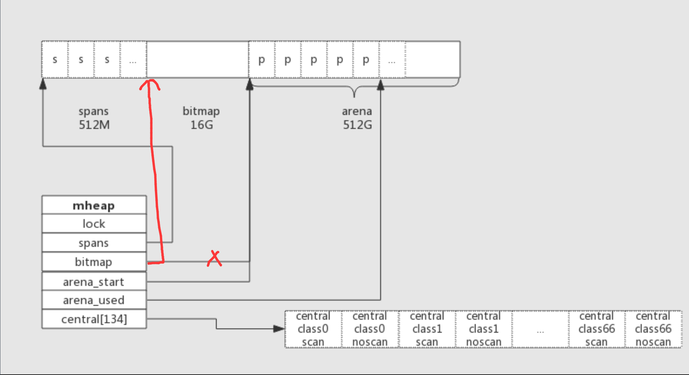

# 内存

## 1. 基础概念

Go 中的内存分配器原理和 tcmalloc 类似，简单来说就是维护一块大的全局内存，P 中维护一块小的私有内存，私有内存不足时再从全局申请

为了方便自主管理内存，一般做法是先向系统申请一块内存，然后将内存切割成小块，通过一定的内存分配算法管理内存

以 64 位系统为例，Golang 程序启动时会向系统申请的内存如下图所示：


预分配的内存划分为 spans、bitmap 和 arena 三部分。

- arena 即所谓的堆区，应用中需要的内存从这里分配，其大小为 512G，为了管理方便，把 arena 区域划分为一个个的 page，每个 page 的大小是 8KB，一共有 512GB/8KB 个页
- spans 用来管理 arena 区，存放 span 的指针，每个指针对应一个或多个 page，所以 span 区域的大小为(512GB/8KB)*指针大小（8byte）= 512M
- bitmap 也是用来管理 arena 区的，主要用于 GC

### 1. span

span 是用来管理 arena 区域的关键数据，每个 span 包含一个或多个连续 page

为满足小对象分配，span 中的一页会划分为更小粒度

为满足大对象分配，通过多页实现

#### 1. class

根据对象大小，划分了一系列 class，每个 class 都代表一个固定大小的对象，以及每个 span 的大小，如下：

```go
// class  bytes/obj  bytes/span  objects  waste bytes
//     1          8        8192     1024            0
//     2         16        8192      512            0
//     3         32        8192      256            0
//     4         48        8192      170           32
//     5         64        8192      128            0
//     6         80        8192      102           32
//     7         96        8192       85           32
//     8        112        8192       73           16
//     9        128        8192       64            0
//    10        144        8192       56          128
//    11        160        8192       51           32
//    12        176        8192       46           96
//    13        192        8192       42          128
//    14        208        8192       39           80
//    15        224        8192       36          128
//    16        240        8192       34           32
//    17        256        8192       32            0
//    18        288        8192       28          128
//    19        320        8192       25          192
//    20        352        8192       23           96
//    21        384        8192       21          128
//    22        416        8192       19          288
//    23        448        8192       18          128
//    24        480        8192       17           32
//    25        512        8192       16            0
//    26        576        8192       14          128
//    27        640        8192       12          512
//    28        704        8192       11          448
//    29        768        8192       10          512
//    30        896        8192        9          128
//    31       1024        8192        8            0
//    32       1152        8192        7          128
//    33       1280        8192        6          512
//    34       1408       16384       11          896
//    35       1536        8192        5          512
//    36       1792       16384        9          256
//    37       2048        8192        4            0
//    38       2304       16384        7          256
//    39       2688        8192        3          128
//    40       3072       24576        8            0
//    41       3200       16384        5          384
//    42       3456       24576        7          384
//    43       4096        8192        2            0
//    44       4864       24576        5          256
//    45       5376       16384        3          256
//    46       6144       24576        4            0
//    47       6528       32768        5          128
//    48       6784       40960        6          256
//    49       6912       49152        7          768
//    50       8192        8192        1            0
//    51       9472       57344        6          512
//    52       9728       49152        5          512
//    53      10240       40960        4            0
//    54      10880       32768        3          128
//    55      12288       24576        2            0
//    56      13568       40960        3          256
//    57      14336       57344        4            0
//    58      16384       16384        1            0
//    59      18432       73728        4            0
//    60      19072       57344        3          128
//    61      20480       40960        2            0
//    62      21760       65536        3          256
//    63      24576       24576        1            0
//    64      27264       81920        3          128
//    65      28672       57344        2            0
//    66      32768       32768        1            0
```

每列的含义如下：

- class：class ID，每个 span 结构都有一个 class ID，表示该 span 可处理的对象类型
- bytes/obj：该 class 代表对象的字节数
- bytes/span：每个 span 占用堆的字节数，即页数 * 页大小
- objects：每个 span 可分配的对象个数，即（bytes/span）/（bytes/obj）
- waste bytes: 每个 span 产生的内存碎片，即（bytes/span）%（bytes/obj）

上表可见最大的对象的大小是 32K，超过 32K 大小的对象由特殊的 class 表示，该 class ID 为0，每个 class 只包含一个对象

> 个人理解：bytes/obj 代表存放对象的规格，bytes/span 则代表该内存区域的总容量，objects 就是在总容量下，这种规格的对象能存放下多少个，waste bytes 就是被浪费的空间，class 用来代表这一组数据

#### 2. span 结构

span 是内存管理的基本单位，每个 span 用于管理特定大小的 class 对象，根据对象大小（对应上面的 bytes/obj），span 将一个或多个页（对应上面的 bytes/span）拆分成多个块（对应上面的 objects）进行管理

在 src/runtime/mheap.go 中定义了 span 的数据结构：

```go
type mspan struct {
	next *mspan     // 链表前向指针，用于将span链接起来
	prev *mspan     // 链表前向指针，用于将span链接起来
	startAddr uintptr // 所管理页的起始地址
	npages    uintptr // 管理的页数

	nelems uintptr // 管理的块个数，也即有多少个块可供分配，对应上面的 objects

	allocBits  *gcBits  // 分配位图，每一位代表一个块是否已分配
	gcmarkBits *gcBits  // GC 用

	allocCount  uint16        // 已分配块的个数
	spanclass   spanClass     // class ID
	elemsize    uintptr       // class 表中的对象大小，也即块大小，对应上面的 bytes/obj
    ...
}
```

以 class 10 为例，span 和管理的内存如下图所示：


- startAddr 在 span 初始化时指向某个页的地址，这个页开始的 bytes/span 大小内存都交给这个 span 分配管理
- npages = 1 表示这个 span 管理一个页
- nelems = 56 表示这个 span 可分配 56 个块给对象
- allocBits 指向一个位图，每位代表一个块是否被分配
- allocCount = 2 代表有两个块已经被分配，和上面的 allocBits 对应
- spanclass = 10 表示这个 span 管理的对象 class ID 为 10，由此可查表得出 npages、nelems 和 elmsize
- elemsize = 144 表示块大小是 144

> 个人理解：spans 通过划分多种规格的内存单元给 span 管理，span 中通过 classID 对应管理 arena 区域中多块相同大小的内存块，最终对象拿到 spans 区域中 span 管理的一块 arena 区域内存

### 2. cache

mcentral 用来管理 span，当线程需要内存时从 mcentral 管理的 span 申请内存，为了避免多线程申请内存不断加锁，Go 为每个线程分配了 span 缓存，当缓存内存不足再向 mcentral 申请，这个缓存就是 cache

在 src/runtime/mcache.go 中定义了 cache 的数据结构：

```go
type mcache struct {
	alloc [68*2]*mspan // 按class分组的mspan列表
    ...
}
```

alloc 为 mspan 的指针数组，数组大小是 class 种类的 2 倍

数组中的每个元素代表一种 class 类型的 span 列表，每种 class 类型都有两组 span 列表，根据列表中对象是否包含指针区分

根据对象是否包含指针，将对象分为 noscan 和 scan 两类，其中 noscan 代表没有指针，scan 代表有指针，需要 GC 进行扫描

mcache 和 span 的对应关系如下图所示：


cache 在初始化时是没有任何 span 的，在使用过程中会动态地从 central 中获取并缓存下来

### 3. central

cache 作为线程的私有资源为单个线程服务，central 则是全局资源，为多个线程服务

当某个线程的内存不足时会向 central 申请，当某个线程释放内存时又会回收进 central

在 src/runtime/mcentral.go 中定义了 mcentral 的数据结构：

```go
type mcentral struct {
	spanclass spanClass  // span class ID

	partial [2]spanSet // 还有空闲块的 span 列表
	full    [2]spanSet // 没有空闲块的 span 列表
}
```

每个 mcentral 对象只管理特定 class 规格的 span

线程从 central 中获取 span 的步骤如下：

1. 加锁
2. 从 partial 列表中获取一个可用 span，并将其从列表中删除
3. 将取出的 span 放入 full 列表
4. 将 span 返回给线程
5. 解锁
6. 线程将该 span 缓存进 cache

线程将 span 归还的步骤如下：

1. 加锁
2. 将 span 从 full 列表删除
3. 将 span 加入到 partial 列表
4. 解锁

### 4. heap

每个 class 对应一个 mcentral，而 mcentral 的集合存放在 mheap 数据结构中

在 src/runtime/mheap.go 中定义了 mheap 的数据结构（1.16 中 mheap 有变化）：

```go
type mheap struct {
    lock      mutex

    spans []*mspan

    bitmap        uintptr     //指向bitmap首地址，bitmap是从高地址向低地址增长的

    arena_start uintptr        //指示arena区首地址
    arena_used  uintptr        //指示arena区已使用地址位置

    central [67*2]struct {
        mcentral mcentral
        pad      [sys.CacheLineSize - unsafe.Sizeof(mcentral{})%sys.CacheLineSize]byte
    }
}

```

- spans：指向 spans 区域，用于映射 span 和 page 的关系
- bitmap：bitmap 的起始地址
- arena_start：arena 区域的首地址
- arena_used：当前 arena 已使用区域的最大地址
- central：每种 class 对应的两个 mcentral

从数据结构可见，mheap 管理着全部的内存，事实上 Golang 就是通过一个mheap 类型的全局变量进行内存管理的

mheap内存管理示意图如下：



## 2. 内存分配过程

针对待分配对象的大小不同有不同的分配逻辑：

- (0, 16B) 且不包含指针的对象：Tiny分配
- (0, 16B) 包含指针的对象：正常分配
- [16B, 32KB]：正常分配
- (32KB, ∞)：大对象分配

其中 Tiny 分配和大对象分配都属于内存管理的优化范畴，这里仅关注一般的分配方法

以申请 size 为 n 的内存为例，分配步骤如下：

1. 获取当前线程的私有缓存 mcache
2. 根据 size 计算出合适的 class ID
3. 从 mcache 的 alloc[class] 链表中查询可用的 span
4. 如果 mcache 没有可用的 span，则从 mcentral 申请一个新的 span 加入 mcache
5. 如果 mcentral 中页没有可用的 span，则从 mheap 中申请一个新的 span 加入 mcentral
6. 从该 span 中获取空闲对象地址并返回

## 3. 小结

- Golang 程序启动时申请一大块内存，并划分成 spans、bitmap、arena 区域，统一交给 mheap 管理
- arena 区域按页划分成一个个小块
- spans 中的 span 管理一个或多个页
- mcentral 管理多个 span 供线程申请使用
- mcache 作为线程私有资源，资源来源于 mcentral
