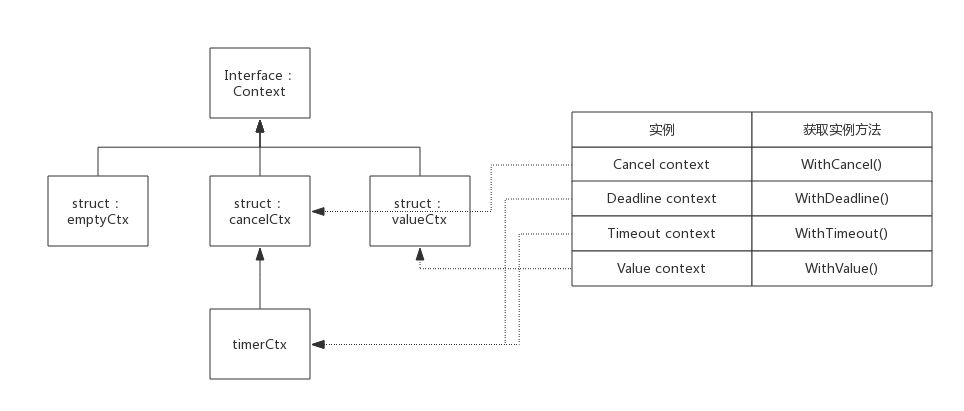

# Context

context 是应用开发常用的并发控制技术，它与 WaitGroup 最大的不同点是 context 对于派生协程有更强的控制力，它可以控制多级的协程

## 1. 实现原理

context 实际上只定义了接口，凡是实现该接口的类都可称为是一种 context，官方包中实现了几个常用的 context，分别用于不同场景

### 1. 接口定义

在 src/context/context.go 中定义了 context 接口：

```go
type Context interface {
    Deadline() (deadline time.Time, ok bool)

    Done() <-chan struct{}

    Err() error

    Value(key interface{}) interface{}
}
```

基础的 context 接口只定义了四个方法：

- Deadline()：该方法返回一个 deadline 和标识是否已设置 deadline 的 bool 值，如果未设置 deadline，则 ok == false，此时 deadline 为一个初始值的 time.Time 值
- Done()：该方法返回一个 channel，通过使用在 select 语句中。
  - 当 context 关闭后，Done() 返回一个被关闭的管道，关闭的管道仍然可读，据此协程可收到关闭请求
  - 当 context 未关闭，Done() 返回 nil
- Err()：该方法描述 context 关闭的原因。关闭原因由 context 实现控制，不需要用户设置。当 context 关闭后，Err() 返回 context 的关闭原因； 当 context 还未关闭时，Err() 返回 nil
- Value()：该方法用于在协程间传值，可以根据 key 值查询 map 中的 value

### 2. 空 context

context 包中定义了一个空的 context，名为 emptyCtx，用于 context 的根节点，emptyCtx 只是简单的实现了 Context，**本身不包含任何值，仅用于其他 context 的父节点**

emptyCtx 类型的定义如下：

```go
type emptyCtx int

func (*emptyCtx) Deadline() (deadline time.Time, ok bool) {
    return
}

func (*emptyCtx) Done() <-chan struct{} {
    return nil
}

func (*emptyCtx) Err() error {
    return nil
}

func (*emptyCtx) Value(key interface{}) interface{} {
    return nil
}
```

context 包中定义了一个公用的 emptCtx 全局变量，名为 background，可以使用 context.Background() 获取它，实现代码如下所示：

```go
var background = new(emptyCtx)

func Background() Context {
    return background
}
```

context 包提供了 4 个方法创建不同类型的 context，使用这四个方法时如果没有父 context，可以传入 background 作为其父节点：

- WithCancel()
- WithDeadline()
- WithTimeout()
- WithValue()

context 包中实现 Context 接口的 struct，除了 emptyCtx 外，还有 cancelCtx、timerCtx 和 valueCtx 三种，正是基于这三种 context 实例，实现了上述 4 种类型的 context

context 包中各 context 类型之间的关系，如下图所示：



### 3. cancelCtx

#### 1. 使用案例

一个使用 cancelCtx 的典型例子如下：

```go
package main

import (
    "context"
    "fmt"
    "time"
)

func HandelRequest(ctx context.Context) {
    go WriteRedis(ctx)
    go WriteDatabase(ctx)
    for {
        select {
        case <-ctx.Done():
            fmt.Println("HandelRequest Done.")
            return
        default:
            fmt.Println("HandelRequest running")
            time.Sleep(2 * time.Second)
        }
    }
}

func WriteRedis(ctx context.Context) {
    for {
        select {
        case <-ctx.Done():
            fmt.Println("WriteRedis Done.")
            return
        default:
            fmt.Println("WriteRedis running")
            time.Sleep(2 * time.Second)
        }
    }
}

func WriteDatabase(ctx context.Context) {
    for {
        select {
        case <-ctx.Done():
            fmt.Println("WriteDatabase Done.")
            return
        default:
            fmt.Println("WriteDatabase running")
            time.Sleep(2 * time.Second)
        }
    }
}

func main() {
    ctx, cancel := context.WithCancel(context.Background())
    go HandelRequest(ctx)

    time.Sleep(5 * time.Second)
    fmt.Println("It's time to stop all sub goroutines!")
    cancel()

    //Just for test whether sub goroutines exit or not
    time.Sleep(5 * time.Second)
}

```

使用 context.WithCanel() 方法传入 emptyCtx 作为父 context 将返回一个子 context 和一个 cancel() 方法，执行 cancel() 方法，关闭自己和子 context，此时 case 中的 Done() 方法的管道将收到关闭请求，从而能够顺利结束

上面代码中 main 协程创建 context，并把 context 在各子协程间传递，main 协程在适当的时机执行 cancel() 方法可以 cancel 掉所有子协程

程序输出如下：

```shell
HandelRequest running
WriteDatabase running
WriteRedis running
HandelRequest running
WriteDatabase running
WriteRedis running
HandelRequest running
WriteDatabase running
WriteRedis running
It's time to stop all sub goroutines!
WriteDatabase Done.
HandelRequest Done.
WriteRedis Done.
```

#### 2. 数据结构

WithCancel() 方法返回的是 cancelCtx 类型的 context

在 src/context/context.go 中定义了 cancelCtx 的数据结构：

```go
type cancelCtx struct {
    Context

    mu       sync.Mutex            // protects following fields
    done     chan struct{}         // created lazily, closed by first cancel call
    children map[canceler]struct{} // set to nil by the first cancel call
    err      error                 // set to non-nil by the first cancel call
}
```

children 中记录了由此 context 派生的所有 child，此 context 被 cancel 时会把其中的所有 child 都 cancel 掉

cancelCtx 与 deadline 和 value 无关，所以只需要实现 Done() 和 Err() 外露接口即可

#### 3. Done() 接口实现

按照 Context 定义，Done() 接口需要返回一个 channel，对于 cancelCtx 来说只需要返回成员变量 done 即可：

```go
func (c *cancelCtx) Done() <-chan struct{} {
    c.mu.Lock()
    if c.done == nil {
        c.done = make(chan struct{})
    }
    d := c.done
    c.mu.Unlock()
    return d
}
```

由于 cancelCtx 没有指定初始化函数，所以 cancelCtx.done 可能还未分配，所以需要考虑初始化

#### 4. Err() 接口实现

按照 Context 定义，Err() 需要返回一个 error 告知 context 被关闭的原因。对于 cancelCtx 来说只需要返回成员变量 err 即可：

```go
func (c *cancelCtx) Err() error {
    c.mu.Lock()
    err := c.err
    c.mu.Unlock()
    return err
}
```

cancelCtx.err 默认是 nil，在 context 被 cancel 时指定一个 error 变量：`var Canceled = errors.New("context canceled")`

#### 5. cancel() 接口实现

WithCancel() 方法返回的第二个值是 CancelFunc 函数类型的 cancel 函数变量

cancel() 内部方法是理解 cancelCtx 的最关键的方法，其作用是关闭自己和其后代 context，其后代存储在 cancelCtx.children 的 map 中，其中 key 值即后代对象，value 值并没有意义，这里使用 map 只是为了方便查询而已，其源码如下：

```go
func (c *cancelCtx) cancel(removeFromParent bool, err error) {
    c.mu.Lock()

    c.err = err      // 设置 error，说明关闭原因
    close(c.done)    // 将 channel 关闭，以此通知派生的 context
    for child := range c.children { // 遍历所有children，逐个调用cancel方法
        child.cancel(false, err)
    }
    c.children = nil
    c.mu.Unlock()

    if removeFromParent {   // 将自己从parent删除
        removeChild(c.Context, c)
    }
}
```

#### 6. WithCancel() 方法实现

WithCancel() 方法做了三件事：

- 初始化一个 cancelCtx 实例
- 将 cancelCtx 实例添加到其父节点的 children 中(如果父节点也可以被 cancel 的话)
- 返回 cancelCtx 实例和 cancel() 方法

```go
func WithCancel(parent Context) (ctx Context, cancel CancelFunc) {
    if parent == nil {
        panic("cannot create context from nil parent")
    }
    c := newCancelCtx(parent)
    propagateCancel(parent, &c)  // 将自身添加到父节点
    return &c, func() { c.cancel(true, Canceled) }
}
```

将自身添加到父节点的过程如下：

1. 如果父节点也支持 cancel，也就是说其父节点肯定有 children 成员，那么把新 context 添加到 children 里
2. 如果父节点不支持 cancel，就继续向上查询，直到找到一个支持 cancel 的节点，把新 context 添加到 children 里
3. 如果所有的父节点均不支持 cancel ，则启动一个协程等待父节点结束，然后再把当前 context 结束

### 4. timerCtx

#### 1. 使用案例

一个使用 timerCtx 的典型例子如下：

```go
package main

import (
    "context"
    "fmt"
    "time"
)

func HandelRequest(ctx context.Context) {
    go WriteRedis(ctx)
    go WriteDatabase(ctx)
    for {
        select {
        case <-ctx.Done():
            fmt.Println("HandelRequest Done.")
            return
        default:
            fmt.Println("HandelRequest running")
            time.Sleep(2 * time.Second)
        }
    }
}

func WriteRedis(ctx context.Context) {
    for {
        select {
        case <-ctx.Done():
            fmt.Println("WriteRedis Done.")
            return
        default:
            fmt.Println("WriteRedis running")
            time.Sleep(2 * time.Second)
        }
    }
}

func WriteDatabase(ctx context.Context) {
    for {
        select {
        case <-ctx.Done():
            fmt.Println("WriteDatabase Done.")
            return
        default:
            fmt.Println("WriteDatabase running")
            time.Sleep(2 * time.Second)
        }
    }
}

func main() {
    ctx, _ := context.WithTimeout(context.Background(), time.Second*3)
    go HandelRequest(ctx)

    time.Sleep(5 * time.Second)
}
```

使用 context.WithTimeout() 方法创建一个 3s 超时的 timerCtx，并将其传递给子协程，3s 自动关闭 context

和上面执行 context.WithCancel() 创建的 cancelCtx 相比不需要手动执行 cancel() 方法关闭全部 context

程序输出如下：

```shell
HandelRequest running
WriteRedis running
WriteDatabase running
WriteDatabase running
HandelRequest running
WriteRedis running
HandelRequest Done.
WriteDatabase Done.
WriteRedis Done.
```

#### 2. 数据结构

在 src/context/context.go 中定义了 timerCtx 的数据结构

```go
type timerCtx struct {
    cancelCtx
    timer *time.Timer // Under cancelCtx.mu.

    deadline time.Time
}
```

timerCtx 在 cancelCtx 基础上增加了 deadline 用于标示自动 cancel 的最终时间，而 timer 就是一个触发自动 cancel 的定时器，由此衍生出 WithDeadline() 和 WithTimeout()。实现上这两种类型实现原理一样，只不过使用语境不一样：

- deadline：指定最后期限，比如 context 将于 2018.10.20 00:00:00 时自动结束
- timeout：指定最长存活时间，比如 context 将在 30s 后结束

对于接口来说，timerCtx 在 cancelCtx 基础上还需要实现 Deadline() 和 cancel() 方法，其中 cancel() 方法是重写的

#### 3. Deadline() 接口实现

Deadline() 接口仅仅返回 timerCtx.deadline，timerCtx.deadline 是由 WithDeadline() 或 WithTimeout() 方法设置：

```go
func (c *timerCtx) Deadline() (deadline time.Time, ok bool) {
    return c.deadline, true
}
```

#### 4. cancel() 接口实现

cancel() 方法基本继承 cancelCtx，只需要额外把 timerCtx.timer 关闭

```go
func (c *timerCtx) cancel(removeFromParent bool, err error) {
    c.cancelCtx.cancel(false, err)
    if removeFromParent {
        removeChild(c.cancelCtx.Context, c)
    }
    c.mu.Lock()
    if c.timer != nil {
        c.timer.Stop()  // 关闭 timer
        c.timer = nil
    }
    c.mu.Unlock()
}
```

#### 5. WithDeadline() 方法的实现

WithDeadline() 方法实现步骤如下：

- 初始化一个 timerCtx 实例
- 将 timerCtx 实例添加到其父节点的 children 中(如果父节点也可以被 cancel 的话)
- 启动定时器，定时器到期后会自动 cancel 该 context
- 返回 timerCtx 实例和 cancel() 方法

也即 timerCtx 类型的 context 不仅支持手动 cancel，也会在定时器到来后自动 cancel

其源码如下：

```go
func WithDeadline(parent Context, d time.Time) (Context, CancelFunc) {
    // 初始化 timerCtx 实例
    c := &timerCtx{
        cancelCtx: newCancelCtx(parent),
        deadline:  d,
    }
    // 将自身添加到父节点
    propagateCancel(parent, c)
    // 启动定时器
    dur := time.Until(d)
    if dur <= 0 {
        c.cancel(true, DeadlineExceeded) // deadline has already passed
        return c, func() { c.cancel(false, Canceled) }
    }
    c.mu.Lock()
    defer c.mu.Unlock()
    if c.err == nil {
        // 定时器到期执行 cancel 方法
        c.timer = time.AfterFunc(dur, func() {
            c.cancel(true, DeadlineExceeded)
        })
    }
    return c, func() { c.cancel(true, Canceled) }
}
```

#### 6. WithTimeout() 方法的实现

WithTimeout() 方法实际调用了 WithDeadline()

```go
func WithTimeout(parent Context, timeout time.Duration) (Context, CancelFunc) {
    return WithDeadline(parent, time.Now().Add(timeout))
}
```

### 5. valueCtx

#### 1. 使用案例

一个使用 valueCtx 的典型例子如下：

```go
package main

import (
    "context"
    "fmt"
    "time"
)

func HandelRequest(ctx context.Context) {
    for {
        select {
        case <-ctx.Done():
            fmt.Println("HandelRequest Done.")
            return
        default:
            fmt.Println("HandelRequest running, key: ", ctx.Value("key"))
            time.Sleep(time.Second)
        }
    }
}

func main() {
    ctx := context.WithValue(context.Background(), "key", "1888")
    go HandelRequest(ctx)

    time.Sleep(3 * time.Second)
}
```

main() 中通过 WithValue() 方法获得一个 valueCtx 实例，然后通将该 context 传递给子协程 HandelRequest，子协程可以读取到 context 的 key-value，但是 valueCtx 不支持 cancel，定时或手动结束，也就是说 <-ctx.Done() 永远无法返回。如果需要返回，需要在创建 context 时指定一个可以 cancel 的 context 作为父节点，使用父节点的 cancel() 在适当的时机结束整个 context

#### 2. 数据结构

在 src/context/context.go 中定义了 valueCtx 的数据结构：

```go
type valueCtx struct {
    Context
    key, val interface{}
}
```

valueCtx 只是在 Context 基础上增加了一个 key-value 对，用于在各级协程间传递一些数据

由于 valueCtx 既不需要 cancel，也不需要 deadline，那么只需要实现 Value() 接口即可

#### 3. Value() 接口实现

```go
func (c *valueCtx) Value(key interface{}) interface{} {
    if c.key == key {
        return c.val
    }
    return c.Context.Value(key)
}
```

当前 context 查找不到 key 时，会向父节点查找，如果查询不到则最终返回 interface{}

#### 4. WithValue() 方法的实现

```go
func WithValue(parent Context, key, val interface{}) Context {
    if key == nil {
        panic("nil key")
    }
    return &valueCtx{parent, key, val}
}
```

## 2. 小结

- Context 仅仅是一个接口定义，根据实现的不同，可以衍生出不同类型的 context
- cancelCtx 实现了 Context 接口，通过 WithCancel() 创建 cancelCtx 实例
- timerCtx 实现了 Context 接口，通过 WithDeadline() 和 WithTimeout() 创建 timerCtx 实例
- valueCtx 实现了 Context 接口，通过 WithValue() 创建 valueCtx 实例
- 三种 context 实例可互为父节点，从而组合成不同的应用形式
