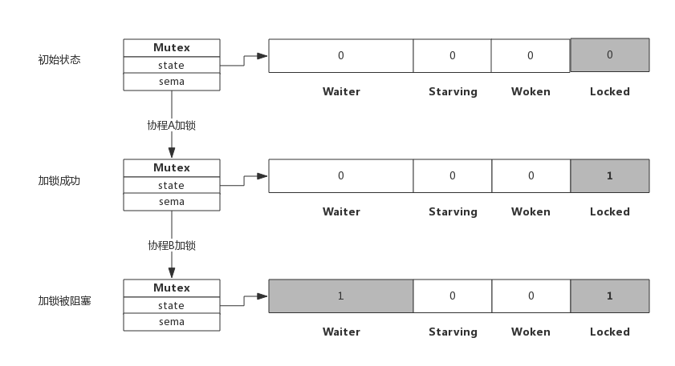
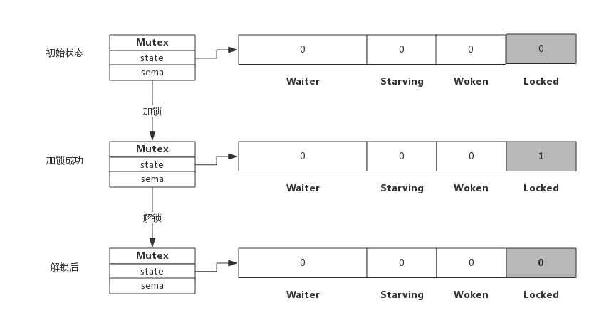

# Mutex

互斥锁是并发程序中对共享资源进行访问控制的主要手段，Go 语言提供了非常简单易用的 Mutex，Mutex 为一结构体类型，对外暴露 Lock() 和 Unlock() 分别用于加锁和解锁

## 1. Mutex 的数据结构

在 src/sync/mytex.go 中定义了 mutex 的数据结构：

```go
type Mutex struct {
	state int32
	sema  uint32
}
```

其中 state 表示当前互斥锁的状态，而 sema 是用于控制锁状态的信号量

内部实现时将 state 分成四份，用于记录 Mutex 的四种状态

下图展示了 Mutex 的内存布局：


- Locked：表示该 Mutex 是否已被锁定，0 表示没有锁定，1 表示已被锁定
- Woken：表示是否有协程已被唤醒，0 表示没有协程唤醒，1 表示已有协程唤醒，正在加锁中
- Starving：表示该 Mutex 是否处于饥饿状态，0 表示没有饥饿，1 表示饥饿状态，说明有协程阻塞超过了 1ms
- Waiter：表示阻塞等待锁的协程个数，协程解锁时根据此值来判断是否需要释放信号量

协程之间的抢锁过程实际上是争抢给 Locked 赋值的权利，能给 Locked 置 1，说明抢锁成功，抢不到就阻塞等待 sema 信号量，一旦持有锁的协程解锁，等待的协程会依次被唤醒

Mutex 对外提供两个方法：

- Lock()：加锁方法
- Unlock()：解锁方法

## 2. 加解锁过程

加锁和解锁的过程总共有四种情况：

- 加锁
  - 加锁成功
  - 加锁被阻塞
- 解锁
  - 解锁成功
  - 解锁并唤醒阻塞协程

### 1. 简单加锁

假定当前只有一个协程在加锁，没有其他协程干扰，那么过程如下图所示：


加锁过程会去判断 Locked 标志位是否为 0，如果是 0 则把 Locked 位置 1，代表加锁成功

### 2. 加锁被阻塞

假定加锁时，锁已被其他协程占用了，此时加锁过程如下图所示：



当协程 B 对一个已被占用的锁再次加锁时，Waiter 计数器增加了 1，此时协程 B 将被阻塞，直到 Locked 值变为 0 后才会被唤醒

### 3. 简单解锁

假定解锁时，没有其他协程阻塞，此时解锁过程如下图所示：



此时解锁时只需要把 Locked 位置 0 即可

### 4. 解锁并唤醒协程

假定解锁时，有 1 个或多个协程阻塞，此时解锁过程如下图所示：


协程 A 的解锁过程分为两步：

1. 把 Locked 位置 0
2. 发现 Waiter > 0，释放信号量唤醒一个阻塞的协程

被唤醒协程 B 把 Locked 位置 1，于是协程 B 获得锁

##  3. 自旋过程

加锁时，如果当前协程发现 Locked 位为 1，说明当前该锁被其他协程持有，当前协程不会马上转入阻塞，而是在**短时间**内持续性地探测 Locked 位是否变为 0，如果变为 0，当前协程可以立即获取锁。

此时如果有其他被唤醒的协程，被唤醒的协程无法获取锁，只能再次阻塞

自旋的好处是，当加锁失败时不必立即转入阻塞，可以避免协程的切换

> 阻塞时会让出 CPU，自旋是不会让 CPU 的

### 1. 什么是自旋

自旋对应于 CPU 的 PAUSE 指令，该指令只会占用 CPU 并消耗 CPU 时间，当前实现是 30 个时钟周期

### 2. 自旋条件

自旋过程会保持对 CPU 的占用，所以进入自旋的条件非常苛刻：

- 只有在普通模式下才能进入自旋
- CPU 核数大于 1
- 当前协程为了获取该锁自旋最多 4 次
- 当前机器上至少存在一个正在运行的处理器 P 并且处理的运行队列为空

### 3. 自旋优势

自旋的优势是更充分的利用 CPU，尽量避免协程切换

### 4. 自旋的问题

自旋过程中获得锁，将导致之前阻塞的协程无法获得锁，如果加锁的协程多，每次通过自旋获得锁，将导致阻塞的协程很难获得锁，从而被饿死

为了解决这个问题，Go 在 1.9 中为 Mutex 引入饥饿状态，当进入饥饿状态，在这个状态下不会自旋，一旦有协程释放锁，那么一定会唤醒一个阻塞协程并成功加锁

## 4. Mutex 的模式

### 1. normal 模式

该模式下，如果协程加锁不成功不会立即转入阻塞排队，而是判断是否满足自旋条件，尝试自旋抢锁

### 2. starvation 模式

协程释放锁时，如果发现 Waiter >0（有阻塞的协程），会释放信号量唤醒阻塞协程，被唤醒的协程获得 CPU 后开始运行，但是如果此刻有自旋协程，锁多半被自旋协程获取（自旋占有 CPU，被唤醒的协程还要等待 CPU），被唤醒的协程只有再次阻塞，不过阻塞前会判断自上次阻塞到本次阻塞经过了多长时间，如果超过 1ms，则将 Starving 位置 1，进入饥饿状态

在饥饿模式下，协程不会自旋，一旦有协程释放了锁，一定会唤醒一个阻塞协程并成功获取锁，同时将 Waiter 减 1

当 Waiter 为 0，或者协程获取锁时等待的时间少于 1ms，再次将 Starving 位置 0，进入正常模式

## 5. Woken 状态

Woken 状态用于加锁和解锁过程的通信

例如同一时刻有两个协程，一个在释放锁一个在自旋等锁，自旋等锁的协程可以将 Woken 置 1，用于通知释放锁的协程不必再释放信号量

## 6.  为什么重复解锁要触发 panic

当执行 Unlock() 时，当阻塞协程大于 0，会释放信号量

如果多次 Unlock()，可能多次释放信号量，唤醒多个协程抢锁，增加 Lock() 实现的复杂度，也会引起不必要的协程切换

## 7. 编程 Tips

### 1. 使用 defer 避免死锁

加锁后立即使用 defer 对其解锁，可以有效的避免死锁

### 2. 加锁和解锁应该成对出现

加锁和解锁最好出现在同一个层次的代码块中，比如同一个函数中

重复解锁会引起panic，应避免这种操作的可能性