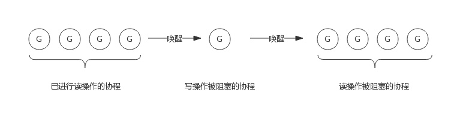

# RWMutex

RWMutex 是对 Mutex 的改进，在读写并发场景下有更高的性能

它不限制并发读，但是读写、写写并发无法执行

实现 RWMutex 需要解决如下问题：

- 写锁需要阻塞写锁：一个协程持有写锁时，其他协程获取写锁需要阻塞
- 写锁需要阻塞读锁：一个协程持有写锁时，其他协程获取读锁需要阻塞
- 读锁需要阻塞写锁：一个协程持有读锁时，其他协程获取写锁需要阻塞
- 读锁不能阻塞读锁：一个协程持有读锁时，其他协程也可以获取读锁

## 1. RWMutex 的数据结构

### 1. 数据结构

在 src/sync/rwmutex.go 中定义了 RWMutex 的数据结构：

```go
type RWMutex struct {
    // 用于控制多个写锁，获得写锁前需要先获取该锁，如果有写锁被持有，那么再获取写锁的协程被阻塞
    w           Mutex
    // 写阻塞的协程等待的信号量，最后释放读锁时会释放信号量
    writerSem   uint32
    // 读阻塞的协程等待的信号量，持有写锁的协程释放锁后会释放信号量
    readerSem   uint32
    // 存储当前正在执行的读操作数量
    readerCount int32
    // 当写操作被阻塞时等待的读操作个数
    readerWait  int32
}
```

可以看到，RWMutex 借助 Mutex 实现，用于将两个写操作隔离开来，其他变量都用于隔离读操作和写操作

### 2. 接口定义

RWMutex 提供四个接口：

- RLock()：获取读锁
- RUnLock()：释放读锁
- Lock()：获取写锁，与 Mutex 完全一致
- UnLock()：释放写锁，与 Mutex 完全一致

#### 1. Lock() 的实现逻辑

获取写锁过程：

- 获取互斥锁
- 阻塞当前协程等待所有读操作结束（如果有的话）

实现流程如下图：

_的实现逻辑.png>)

其源码如下：

```go
func (rw *RWMutex) Lock() {
    // 尝试获取互斥锁
    rw.w.Lock()
    // 通过修改 readerCount 为负数，来阻塞后续的读操作
    r := atomic.AddInt32(&rw.readerCount, -rwmutexMaxReaders) + rwmutexMaxReaders
    // 如果有正在执行的读操作，阻塞当前协程
    if r != 0 && atomic.AddInt32(&rw.readerWait, r) != 0 {
        runtime_SemacquireMutex(&rw.writerSem, false, 0)
    }
}
```

#### 2. Unlock() 的实现逻辑

释放写锁过程：

- 唤醒因获取读锁而被阻塞的协程（如果有的话）
- 释放互斥锁

实现流程如下图：

_的实现逻辑.png>)

其源码为：

```go
func (rw *RWMutex) Unlock() {
    // 将 readerCount 修改回正数
    r := atomic.AddInt32(&rw.readerCount, rwmutexMaxReaders)
    if r >= rwmutexMaxReaders {
        throw("sync: Unlock of unlocked RWMutex")
    }
    // 释放所有因为获取读锁而陷入阻塞的协程
    for i := 0; i < int(r); i++ {
        runtime_Semrelease(&rw.readerSem, false, 0)
    }
    // 释放写锁
    rw.w.Unlock()
}
```

#### 3. RLock() 的实现逻辑

获取读写锁过程：

- 对当前正在执行的读操作计数+1，即 readerCount++
- 阻塞等待写锁释放（如果有的话）

实现流程如下图：

_的实现逻辑.png>)

其源码如下：

```go
func (rw *RWMutex) RLock() {
    // 执行 readerCount++
    // 如果 AddInt32 返回负数，说明其他协程获取了写锁，则当前协程阻塞等待
    // 如果 AddInt32 返回非负数，说明没有协程获取写锁，成功获取读锁
    if atomic.AddInt32(&rw.readerCount, 1) < 0 {
        runtime_SemacquireMutex(&rw.readerSem, false, 0)
    }
}
```

#### 4. RUnlock() 的实现逻辑

释放读锁过程：

- 对当前正在执行的读操作计数-1，即 readerCount--
- 唤醒等待写锁的协程（如果有的话，且当前读锁释放后无其他持有读锁的协程）

实现流程如下图：

_的实现逻辑.png>)

其源码如下：

```go
func (rw *RWMutex) RUnlock() {
    // 执行 readerCount--
    // 如果 AddInt32 返回负数，说明其他协程获取了写锁，调用 rUnlockSlow 方法
    // 如果 AddInt32 返回非负数，说明没有协程获取写锁，成功释放读锁
    if r := atomic.AddInt32(&rw.readerCount, -1); r < 0 {
        rw.rUnlockSlow(r)
    }
}

func (rw *RWMutex) rUnlockSlow(r int32) {
    if r+1 == 0 || r+1 == -rwmutexMaxReaders {
        throw("sync: RUnlock of unlocked RWMutex")
    }
    // 执行 readerWait--
    // 如果 AddInt32 返回 0，说明当前协程是最后一个释放读锁的协程，尝试唤醒写锁的协程
    if atomic.AddInt32(&rw.readerWait, -1) == 0 {
        runtime_Semrelease(&rw.writerSem, false, 1)
    }
}
```

## 2. 场景分析

### 1. 写操作是如何阻止写操作的

借助互斥锁，获取写锁前先尝试执行互斥锁的 Lock()

### 2. 写操作是如何阻止读操作的

协程 A 加写锁时，将 readerCount 减少 1<<30，设置为负数，当协程 B 尝试获取读锁时，发现 readerCount 为负数，阻塞等待

### 3. 读操作是如何阻止写操作的

协程 A 获取读锁时，将 readerCount++，协程 B 尝试获取写锁，发现 readerCount 不为 0，阻塞等待

### 4. 为什么写锁不会被饿死

获取写锁时会先加互斥锁，再等待读锁释放，如果获取写锁期间不断有新的读锁被协程获取，如果获取写锁需要等到全部读锁被释放，那获取写锁的协程很可能被饿死

写操作到来时，会把 RWMutex.readerCount 值拷贝到 RWMutex.readerWait 中，用于标记写操作被阻塞时等待的读操作个数

前面的读操作结束后，除了会递减 RWMutex.readerCount，还会递减 RWMutex.readerWait 值，当 RWMutex.readerWait 值变为 0 时唤醒写操作

所以，写操作就相当于把一段连续的读操作划分成两部分，前面的读操作结束后唤醒写操作，写操作结束后唤醒后面的读操作。如下图所示：


