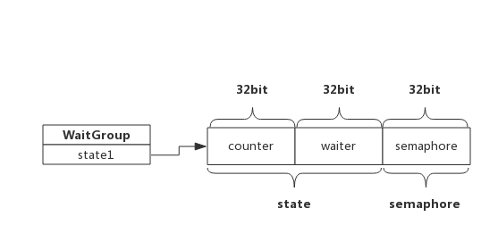

# WaitGroup 的使用

WaitGroup 是 Go 应用开发过程中经常使用的并发控制技术

某个协程需要等待其他几个协程全部完成，使用 WaitGroup 可以轻松完成

## 1. 场景示例

在协程中使用 WaitGroup 等待其他协程结束：

```go
func main() {
	var wg sync.WaitGroup

	wg.Add(2)
	go func() {
		// do something
		time.Sleep(1 * time.Second)

		fmt.Println("Goroutine 1 finished!")
		// goroutine执行结束后将计数器减1
		wg.Done()
	}()

	go func() {
		// do something
		time.Sleep(2 * time.Second)

		fmt.Println("Goroutine 2 finished!")
		// goroutine执行结束后将计数器减1
		wg.Done()
	}()

    // 主goroutine阻塞等待计数器变为0
	wg.Wait()
	fmt.Printf("All Goroutine finished!")
}
```

 wg 内部维护了一个信号量：

- 启动协程前将计数器通过 Add(2) 将计数器设置为待启动的协程个数
- 启动协程后，使用 Wait() 方法阻塞自己，等待计数器变为 0
- 每个协程执行结束通过 Done() 方法将计数器减 1
- 计数器变为 0 后，阻塞的协程被唤醒

 ## 2. 基础知识

WaitGroup 实现中使用了信号量

信号量是 Unix 系统提供的一种保护共享资源的机制，用于防止多个线程同时访问某个资源

信号量可简单理解为一个数值：

- 当信号量 > 0 时，表示资源可用，获取信号量时系统自动将信号量减 1
- 当信号量 = 0 时，表示资源暂不可用，获取信号量时，当前线程会进入睡眠，当信号量为正时被唤醒

## 3. 编程 Tips

- Add() 操作必须早于 Wait()，否则会触发 panic
- Add() 设置的值必须与实际等待的协程个数一致，否则会触发 panic

# WaitGroup 的实现原理

## 1. 数据结构

在 src/sync/waitgroup.go 中定义了 WaitGroup 的数据结构：

```go
type WaitGroup struct {
	state1 [3]uint32  // 存储状态和信号量
}
```

state1 是一个长度为 3 的数组，这个数组包含 state 和一个信号量，state 实际上是两个计数器：

- counter：当前还未执行结束的协程计数器（对还未执行到 Done() 的协程计数）
- waiter count：在等待结束的协程计数器（对执行到 Wait() 的协程计数）
- semaphore：信号量

考虑到字节是否对齐，三者出现的位置不同，为简单起见，依照字节已对齐情况下，三者在内存中的位置如下所示：



WaitGroup 对外提供三个接口：

- Add(delta int)：将 delta 值加到 counter 中
- Wait()：waiter 递增 1，并阻塞等待信号量 semaphore
- Done()：counter 递减 1，按照 waiter 数值释放相应次数信号量

## 2. Add(delta int)

Add() 做了两件事：

- 把 delta 值累加到 counter 中，delta 可以为负值
- 当 counter 值为 0，按照 waiter 数值释放等量的信号量，把等待的协程全部唤醒，如果 counter 值为负，则 panic

其伪代码如下：

```go
func (wg *WaitGroup) Add(delta int) {
    // 获取state和semaphore地址指针
	statep, semap := wg.state()
    
    // 把delta左移32位累加到state，即累加到counter中
	state := atomic.AddUint64(statep, uint64(delta)<<32)
    // 获取counter值
	v := int32(state >> 32)
    // 获取waiter值
	w := uint32(state)
    // 经过累加后counter值变为负值，panic
	if v < 0 {
		panic("sync: negative WaitGroup counter")
	}
	// 经过累加后，此时，counter >= 0
    // 如果counter为正，说明不需要释放信号量，直接退出
    // 如果waiter为零，说明没有等待者，也不需要释放信号量，直接退出
	if v > 0 || w == 0 {
		return
	}
	
    // 此时，counter一定等于0，而waiter一定大于0（内部维护waiter，不会出现小于0的情况），
    // 先把counter置为0，再释放waiter个数的信号量
	*statep = 0
	for ; w != 0; w-- {
        // 释放信号量，执行一次释放一个，唤醒一个等待者
		runtime_Semrelease(semap, false, 0)
	}
}
```

## 3. Wait()

wait() 方法也做了两件事：

- 累加 waiter
- 阻塞等待信号量

其伪代码如下：

```go
func (wg *WaitGroup) Wait() {
    // 获取state和semaphore地址指针
	statep, semap := wg.state()
	for {
        // 获取state值
		state := atomic.LoadUint64(statep)
        // 获取counter值
		v := int32(state >> 32)
        // 获取waiter值
		w := uint32(state)
        // 如果counter值为0，说明所有goroutine都退出了，不需要等待，直接返回
		if v == 0 {
			return
		}
		// 使用CAS累加waiter，累加可能会失败，失败后通过for loop下次重试
		if atomic.CompareAndSwapUint64(statep, state, state+1) {
            // 阻塞等待信号量唤醒自己
			runtime_Semacquire(semap)
			return
		}
	}
}

```

## 4. Done()

Done() 只做一件事，就是把 counter 减 1

```go
func (wg *WaitGroup) Done() {
	wg.Add(-1)
}
```

Done() 通过调用 Add() 方法，最后一个执行 Done() 的协程把进入阻塞状态的协程唤醒